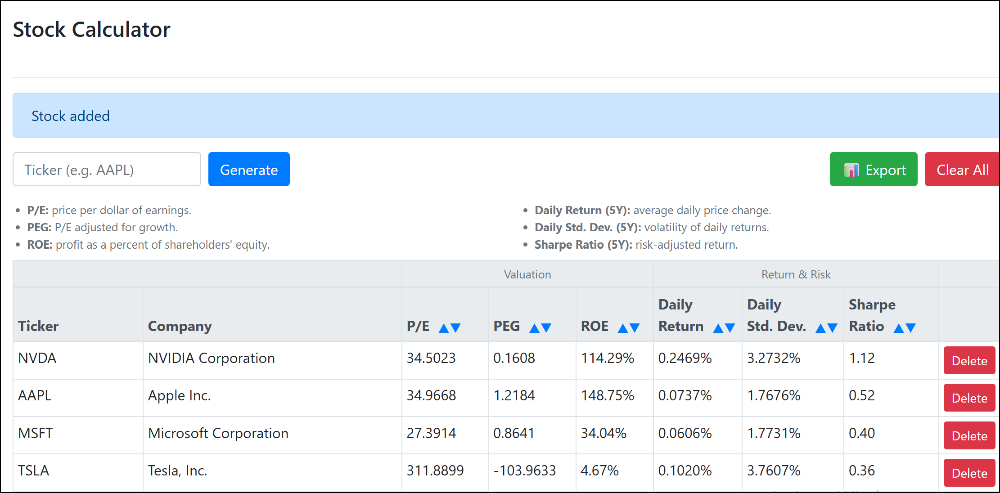

# Stock Calculator

A Flask web app for tracking and comparing stock valuation and risk metrics. Add a ticker and the app pulls live data from Alpha Vantage to compute valuation ratios and 5-year weekly risk/return statistics, stored per-browser-session.



**Live Demo:** https://stock-calculator-ekt0.onrender.com (may take ~30s to wake up on first load)

## Features

- Add any publicly traded ticker and pull live fundamentals via Alpha Vantage
- View valuation metrics at a glance: P/E, PEG, and ROE
- View 5-year return, risk, and risk-adjusted performance: Weekly Return, Weekly Std. Dev., and Sharpe Ratio
- Sort any metric column ascending or descending
- Export the current table to Excel (`.xlsx`), with automatic CSV fallback
- Clear all rows with one click
- Per-browser session persistence (no login required)

## Tech Stack

Flask, Flask-WTF, Flask-SQLAlchemy, SQLite, Alpha Vantage API, pandas, NumPy, APScheduler, Bootstrap 4, pytest

## Run Locally

1. Clone the repo:
   ```bash
   git clone https://github.com/ari-butterfield/stock-calculator.git
   cd stock-calculator
   ```

2. Create and activate a virtual environment:
   ```bash
   python -m venv venv
   # macOS/Linux
   source venv/bin/activate
   # Windows (PowerShell)
   venv\Scripts\Activate.ps1
   ```

3. Install dependencies:
   ```bash
   pip install -r requirements.txt
   ```

4. Set an `ALPHA_VANTAGE_API_KEY` (free at alphavantage.co). `SECRET_KEY` is optional for local dev (falls back to an insecure default) but should always be set to a real value in any public deployment.

5. Run the app:
   ```bash
   python app.py
   ```

6. Visit `http://localhost:5000` in your browser.

## Run Tests

```bash
python -m pytest
```

## License

MIT — see [LICENSE](LICENSE).
